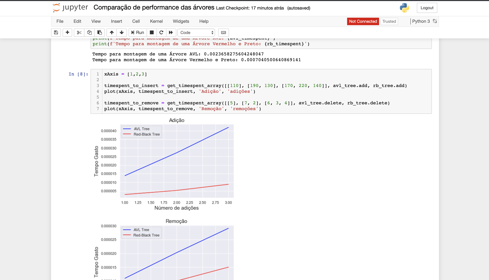

# Comparador de performance entre as Árvores Vermelho e Preto e AVL

## Alunos  
| Matrícula | Nome |  
|-----------------------|---------------------|  
| 17/0065251 | Gustavo Veloso |  
| 17/0039668 | Lucas Ganda |  
## Descrição do projeto
Utilizando algumas bibliotecas do Python e a plataforma Jupyter, fizemos um estudo sobre a diferença de performance entre as duas árvores em situações diversas e executando operações de criação, inserção e remoção das árvores.
## Guia de instalação
### Dependências do projeto
É necessário possuir todo o ambiente do Jupyter instalado na sua máquina
### Como executar o projeto
Apenas execute o comando no diretório do projeto: 
`$ jupyter notebook`
## Capturas de tela
  
## Conclusões
Com estes estudos foi provado todo o estudo teórico que mostrava o quanto as árvores Vermelha e Preta eram mais perfomáticas nas operações de inserção e remoção.
## Referências
Utilizamos um repositório com a implementação completa da Árvore Vermelha e Preta para otimizar nosso tempo e tornar mais confiável o estudo dos dados. [Árvore Vermelha e preta do stanislavkozlovski](https://github.com/stanislavkozlovski/Red-Black-Tree).
